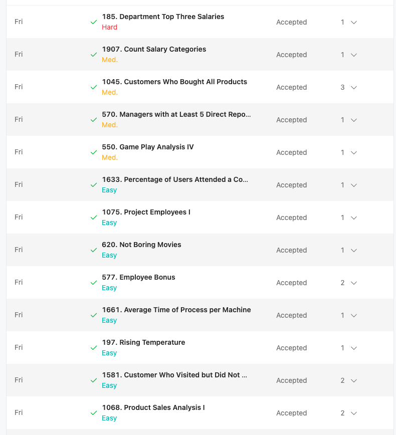
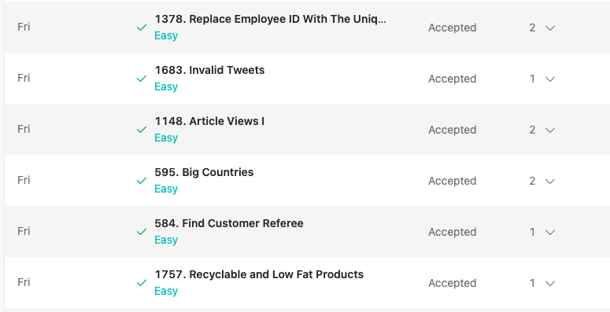

# Hongrui Liu



1. Leetcode #1757
```sql
SELECT
    product_id
FROM
    Products
WHERE
    low_fats = 'Y' AND recyclable = 'Y'
```
2. Leetcode #584
```sql
SELECT name FROM customer WHERE referee_id <> 2 OR referee_id IS NULL;
```
3. Leetcode #595
```sql
SELECT
    name, population, area
FROM
    world
WHERE
    area >= 3000000 OR population >= 25000000;
```
4. Leetcode #1148
```sql
SELECT 
    DISTINCT author_id AS id 
FROM 
    Views 
WHERE 
    author_id = viewer_id 
ORDER BY 
    id 
```
5. Leetcode #1683
```sql
SELECT 
    tweet_id
FROM 
    tweets
WHERE 
    CHAR_LENGTH(content)> 15
```
6. Leetcode #1378
```sql
SELECT 
    EmployeeUNI.unique_id, Employees.name
FROM 
    Employees
LEFT JOIN 
    EmployeeUNI 
ON 
    Employees.id = EmployeeUNI.id;
```
7. Leetcode #1068
```sql
SELECT 
    p.product_name, s.year, s.price
FROM 
    Sales s
JOIN 
    Product p
ON
    s.product_id = p.product_id
```
8. Leetcode #1581
```sql
SELECT 
  customer_id, 
  COUNT(visit_id) AS count_no_trans 
FROM 
  Visits 
WHERE 
  visit_id NOT IN (
    SELECT 
      visit_id 
    FROM 
      Transactions
  ) 
GROUP BY 
  customer_id
```
9. Leetcode #197
```sql
SELECT 
    w1.id
FROM 
    Weather w1
JOIN 
    Weather w2
ON 
    DATEDIFF(w1.recordDate, w2.recordDate) = 1
WHERE 
    w1.temperature > w2.temperature;
```
10. Leetcode #1661
```sql
SELECT 
    machine_id,
    ROUND(SUM(CASE WHEN activity_type='start' THEN timestamp*-1 ELSE timestamp END)*1.0
    / (SELECT COUNT(DISTINCT process_id)),3) AS processing_time
FROM 
    Activity
GROUP BY machine_id
```
11. Leetcode #577
```sql
SELECT
    Employee.name, Bonus.bonus
FROM
    Employee
        LEFT JOIN
    Bonus ON Employee.empid = Bonus.empid
WHERE
    bonus < 1000 OR bonus IS NULL
;
```
12. Leetcode #1280
```sql
SELECT 
    s.student_id, s.student_name, sub.subject_name, IFNULL(grouped.attended_exams, 0) AS attended_exams
FROM 
    Students s
CROSS JOIN 
    Subjects sub
LEFT JOIN (
    SELECT student_id, subject_name, COUNT(*) AS attended_exams
    FROM Examinations
    GROUP BY student_id, subject_name
) grouped 
ON s.student_id = grouped.student_id AND sub.subject_name = grouped.subject_name
ORDER BY s.student_id, sub.subject_name;
```
13. Leetcode #620
```sql
select *
from cinema
where mod(id, 2) = 1 and description != 'boring'
order by rating DESC
;
```
14. Leetcode #1075
```sql
SELECT 
    project_id,
    ROUND(AVG(experience_years), 2) AS average_years
FROM 
    Project p
JOIN 
    Employee e
ON 
    p.employee_id = e.employee_id
GROUP BY 
    project_id
```
15. Leetcode #1633
```sql
SELECT 
  contest_id, 
  ROUND(
    COUNT(DISTINCT user_id) * 100 / ( 
      SELECT 
        COUNT(user_id) 
      FROM 
        Users
    ), 
    2
  ) AS percentage
FROM 
  Register 
GROUP BY 
  contest_id 
ORDER BY 
  percentage DESC, 
  contest_id; 
```
16. Leetcode #550 medium
```sql
SELECT
  ROUND(
    COUNT(A1.player_id)
    / (SELECT COUNT(DISTINCT A3.player_id) FROM Activity A3)
  , 2) AS fraction
FROM
  Activity A1
WHERE
  (A1.player_id, DATE_SUB(A1.event_date, INTERVAL 1 DAY)) IN (
    SELECT
      A2.player_id,
      MIN(A2.event_date)
    FROM
      Activity A2
    GROUP BY
      A2.player_id
  );
```
17. Leetcode #570 medium
```sql
SELECT
    Name
FROM
    Employee AS t1 
JOIN
    (SELECT 
        ManagerId
    FROM 
        Employee
    GROUP BY ManagerId
    HAVING COUNT(ManagerId) >= 5) AS t2
ON 
    t1.Id = t2.ManagerId
;
```
18. Leetcode #1045 medium
```sql
SELECT
  customer_id
FROM
  Customer
GROUP BY
  customer_id
HAVING
  COUNT(DISTINCT product_key) = (
    SELECT
      COUNT(product_key)
    FROM
      Product
  );
```
19. Leetcode #1907 medium
```sql
SELECT 
    'Low Salary' AS category,
    SUM(CASE WHEN income < 20000 THEN 1 ELSE 0 END) AS accounts_count
FROM 
    Accounts
    
UNION
SELECT  
    'Average Salary' category,
    SUM(CASE WHEN income >= 20000 AND income <= 50000 THEN 1 ELSE 0 END) 
    AS accounts_count
FROM 
    Accounts

UNION
SELECT 
    'High Salary' category,
    SUM(CASE WHEN income > 50000 THEN 1 ELSE 0 END) AS accounts_count
FROM 
    Accounts
```
20. Leetcode #185 hard
```sql
SELECT d.name AS 'Department', 
       e1.name AS 'Employee', 
       e1.salary AS 'Salary' 
FROM Employee e1
JOIN Department d
ON e1.departmentId = d.id 
WHERE
    3 > (SELECT COUNT(DISTINCT e2.salary)
        FROM Employee e2
        WHERE e2.salary > e1.salary AND e1.departmentId = e2.departmentId);
```